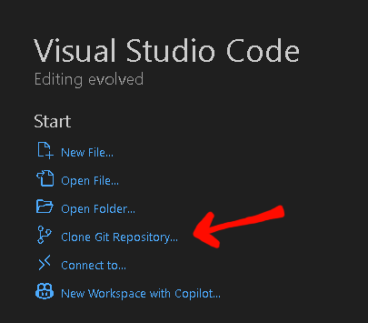

Tebak Anomali (setor hapalan brainrot)
---
Our Team:
- [Felix Ferdinandus (122140070)](https://github.com/ForZa77123)
- [Kiagus M Roihan Ananta (122140073)](https://github.com/roihan123)
- [Pricelia Putri (122140075)](http://github.com/pricelia1508)

Description
---
Guessing Anomaly (Tebak Anomali) is a Python-based interactive filter that combines audio, visuals, and hand gesture recognition. First the program is going displays five brainrot images (Anomali) that are randomly positioned, then play the sound of one of the brainrot (Anomali). Then User will have to match the sound to the correct image of brainrot or anomaly, by forming numbers using their fingers (1 to 5) that represent the image choice. These number gestures will be recognized by the system using MediaPipe-based hand recognition, and used as input to answer questions. If the answer is correct, the user will proceed to the next question and got a points. If wrong, the system will give user no points and will proceed to the next question until the users answer all of the questions (there's 5 questions).

Logbook
---
|Day/Date|Description|Performer(s)|
|---|---|---|
|Saturday/10-05-2025|Discussing the topic of the Project and repository to github.|Felix Ferdinandus, Kiagus M Roihan, Pricelia Putri|
|Wednesday/28-05-2025|Make the program, finding the assets, and Progressing the Final Report|Felix Ferdinandus (Make the program and finding the assets), Kiagus M Roihan (Make the algoritm and finding the assets), Pricelia Putri (Finding the assets)|
|Thursday/29-05-2025|Perfecting and progressing the Program|Felix Ferdinandus (Perfecting the code)|
|Friday/30-05-2025|Fixing and Adding Feature to Program|Felix Ferdinandus (Fixing some Errors), Kiagus M Roihan (Adding sounds and features to program)|
|Saturday/31-05-2025|Finishing the Project and the Project final report.|Felix Ferdinandus (Finishing Program), Kiagus M Roihan (Finishing and tidying up Github and Finishing tbe Project Final Report), Pricelia Putri (Finishing the Project Final Report)|

Instalations
---
1. Clone repository:
   
Open terminal on Visual Code and type this:
```bash
git clone https://github.com/ForZa77123/Tubes_mulmed
```
or just press clone git repository:



2. Install the dependencies in terminal:
```bash
pip install -r requirements.txt
```

3. To run:
run `main.py`

*If there's an error `Error: Could not open video capture device.`. here's what you need to do:
- find this code:
  ```py
  cap = cv2.VideoCapture(1)
  ```
Change the index "1" to 0 until you found your device or camera.

4. Have fun.
